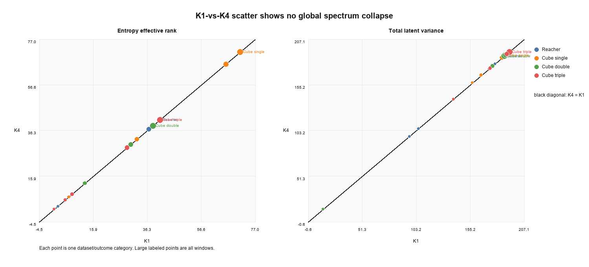
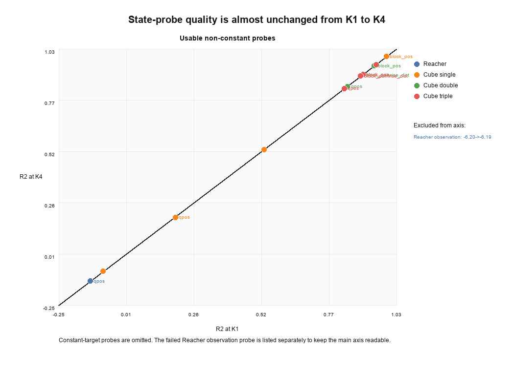
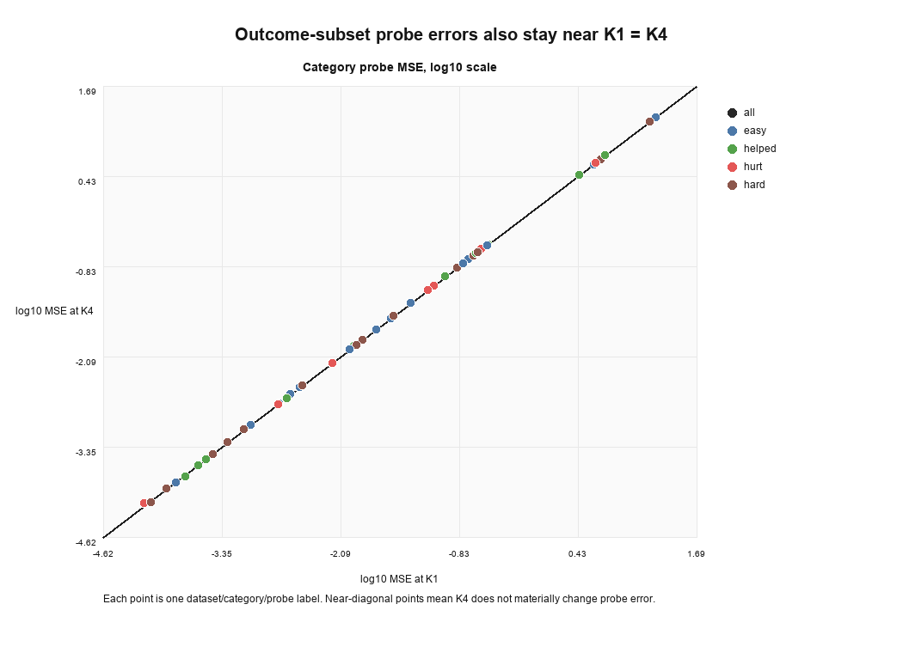

# TTJepa / ThinkJEPA 动态 K 研究草稿

> 中文研究记录。英文 release 说明见 [README.md](README.md)。完整实验结果、路径和日志见 [TTJEPA_EXPERIMENT_RESULTS.md](TTJEPA_EXPERIMENT_RESULTS.md)，工作研究记录见 [TTJEPA_DYNAMIC_K_RESEARCH.md](TTJEPA_DYNAMIC_K_RESEARCH.md)。

## 核心问题

我们现在聚焦一个问题：

> raw latent prediction error 能不能判断一个 imagined transition 需要多少次 recurrent refinement？

也就是说，测试时的 compute 不只可以花在 CEM 采样数、CEM 迭代数、rollout horizon 上，也可以花在每个 latent transition 的 refinement depth `K` 上。

## Motivation

一个直观例子：机器人要去拿桌上的一个物体。

把手伸过去这件事通常不需要太多“思考”：大方向、自由空间运动、接近目标，大部分 transition 都比较简单，粗一点的 dynamics prediction 就够了。但真正把东西拿起来时就不一样了：手指什么时候接触物体、接触后物体会不会滑、抓取角度是否会把目标推开、多个物体是否会相互遮挡或碰撞，这些细节会直接影响最后动作是否成功。这个阶段更应该多花 compute，把 imagined transition refine 得更准。

所以问题不是“机器人每一步都要想很久”，也不是“机器人永远只想一步”。更合理的是：简单 transition 少算，关键 contact transition 多算。

LeWM 这类 latent world-model planner 会把视觉状态和 goal 编码到 latent space，然后在 latent space 里用 CEM/MPC 搜 action sequence。常见做法是固定每一步 transition 的 dynamics predictor 计算量。

这个固定策略在 manipulation 里不理想：

- free-space transition 通常很简单，`K=1` 可能够了。
- contact-rich transition 更难，比如接触、遮挡、多物体绑定、目标相对位姿变化。
- 固定大 `K` 会浪费 compute。
- 固定小 `K` 会漏掉需要更细 dynamics refinement 的 hard case。

所以这篇工作的主线是：在 latent world-model planning 里，模型应该动态选择每个 transition 的 `K`。

## 方法概念

我们基于 LeWM-style latent planning：

1. 编码当前视觉状态和 goal。
2. 在 latent space 里 rollout candidate action sequences。
3. 用 CEM 根据 terminal goal-matching cost 选 action。
4. 只改 transition predictor：把 one-shot predictor 换成 recurrent、weight-tied 的 refinement predictor。

固定深度版本：

- `K=1`：每个 imagined transition refine 一次。
- `K=2/3/4`：每个 transition 固定 refine 多次。

动态深度版本：

- 每一层之后判断是否继续 refine。
- 目标是只在少数真正需要 deeper dynamics 的 transition 上花额外 compute。

这篇 paper 的 focus 是 dynamic 选择 `K`，不是换 action space、不是换 tokenizer、也不是换 planner。

## LeWM Baseline 和固定 K 结果

当前 working-run 结果如下。这里要小心：不同 checkpoint / sweep 不能混在同一行里直接比较。下面表格优先列 raw-MSE 分析使用的 recurrent checkpoint；没有在同一个 checkpoint 上跑过的 fixed depth 标成 `n/a`。

这里的 `LeWM baseline` 和 `Fixed K1` 不是同一个东西：

- `LeWM baseline` 是原始 LeWM 的非 recurrent transition predictor。
- `Fixed K1` 是 TTJepa recurrent predictor 在只跑第一层 refinement 时的结果。
- 所以它们共享 latent planning / CEM 评估框架，但 predictor 架构、训练目标和 checkpoint 都不同。
- 评价 dynamic K 时，最公平的内部对照是同一个 TTJepa checkpoint 的 `Fixed K1/K2/K3/K4`；LeWM baseline 只是外部参考。

| Dataset / run | LeWM baseline | Fixed K1 | Fixed K2 | Fixed K3 | Fixed K4 | 观察 |
| --- | ---: | ---: | ---: | ---: | ---: | --- |
| Reacher seed42 | 80% | 88% | n/a | n/a | 86% | 当前 checkpoint 里 K4 不如 K1 |
| Cube single seed42 | 72% | 80% | n/a | n/a | 78% | K4 略低于 K1 |
| Cube single seed43 | 72% | 88% | n/a | n/a | 90% | K4 比 K1 高 2 个点 |
| Cube single seed44 | 72% | 66% | n/a | n/a | 64% | K4 略低于 K1 |
| Cube single 3-seed avg | 72% | 78% | n/a | n/a | 77.3% | 均值里 K4 略低，但 seed43 显示 K4 可以有用 |
| Cube single original rerun `20260621_refixed_k1234` | 72% | 80% | 76% | 78% | 78% | 同一原始 checkpoint 上补齐 K1-4；K1 最好，K3/K4 回到 78% |
| Cube double original rerun `20260621_refixed_k1234` | 66% | 72% | 70% | 68% | 70% | 同一原始 checkpoint 上额外 depth 没收益 |
| Cube triple original | 74% | 70% | 76% | 76% | 78% | 最清楚地显示 deeper K 有用，主要收益从 K2 开始出现 |

补充说明：

- Cube single 数据没有丢，只是散在多个命名目录里。上表已经把 seed42/43/44 拆开列了，并在原始 checkpoint 上补跑了同源 `K1=80%`, `K2=76%`, `K3=78%`, `K4=78%`。结论不是 “K4 从不有用”，而是 “K4 的收益不稳定”。
- Cube double 原始 raw-MSE 分析 checkpoint 已补齐同源 `K1=72%`, `K2=70%`, `K3=68%`, `K4=70%`。
- Cube triple 原始 recurrent checkpoint 的 fixed-depth 结果最完整：`K1=70%`, `K2=76%`, `K3=76%`, `K4=78%`。whitened、probe-weighted、learned-selector 等探索性 checkpoint 统一保存在 [TTJEPA_EXPERIMENT_RESULTS.md](TTJEPA_EXPERIMENT_RESULTS.md)，不混进 Paper 1 主表。

核心观察：fixed K4 是否优于 K1 是 checkpoint- 和 dataset-dependent，不应该写成“一般规律”。更准确的说法是：cube-triple 原始 recurrent checkpoint 上 K2/K3/K4 都明显优于 K1，说明 transition refinement depth 能改变 planning success；Cube single 有 seed-level improvement，但原始 checkpoint 的补跑显示 K1 仍最好；Reacher 和 Cube double 当前 checkpoint 里不需要大 K。

## 方法一：Raw Latent MSE Stopping

这是我提出的第一个 dynamic-K 方法。

想法很直接：如果 deeper refinement 显著降低 raw latent MSE，就继续用更大的 `K`；否则早停。

它的优点是简单、干净：

- 不用 planner feature。
- 不用 task-specific probe。
- 不额外训练 selector。
- 直接衡量 recurrent refinement 是否改善 latent prediction。

四个数据集上的 raw latent MSE 结果如下。这个分析是一个 K1/K4 动态选择实验：每个 episode 根据 raw latent MSE 决定是否从 K1 升到 K4，所以表里只比较 Fixed K1、Fixed K4、raw-MSE dynamic K 和 hindsight K1/K4 chooser。

| Dataset | Fixed K1 | Fixed K4 | Best raw-MSE dynamic K | Hindsight K1/K4 chooser | K1 fail / K4 success |
| --- | ---: | ---: | ---: | ---: | ---: |
| Reacher | 88%@K1.00 | 86%@K4.00 | 88%@K1.06 to K2.32 | 92%@K1.12 | 2 / 50 |
| Cube single | 78%@K1.00 | 77.3%@K4.00 | 77.3%@K2.72 to K2.96 | 80.7%@K1.08 | 4 / 150 |
| Cube double | 72%@K1.00 | 70%@K4.00 | 72%@K1.00 to K2.62 | 72%@K1.00 | 0 / 50 |
| Cube triple | 70%@K1.00 | 78%@K4.00 | 76%@K2.32 | 82%@K1.36 | 6 / 50 |

分析：

- Raw latent MSE 是一个不错的第一版方法。cube-triple 上它能把 `70%@K1` 提到 `76%@K2.32`，基本拿回了 fixed K4 大部分收益，同时平均 compute 明显低于 K4。
- 这个结果说明 latent prediction error 本身确实携带了“什么时候需要更深 refinement”的信号，不是一个随便的 heuristic。
- 它还没有追上 fixed K4 的 `78%`，也还低于 hindsight K1/K4 chooser 的 `82%@K1.36`。这不是说 raw MSE 很弱，而是说明还有可改进空间：真实最优的 dynamic K 需要更好地区分哪些 transition 的 latent 改善会影响最终 planning。
- Reacher 和 Cube double 上，fixed K4 本身不比 K1 好，所以 raw MSE 多花 compute 也不提升成功率。Cube single 更微妙：有 seed 上 K4 比 K1 好，但 3-seed 均值里 K4 略低，所以 raw MSE 没显示出稳定收益。
- 关键问题是 alignment：raw latent MSE 衡量的是 latent prediction error，而 planner 关心的是 action ranking / success。两者相关，但不完全等价。
- 如果 latent space 被平滑、各维尺度不均、或者丢掉了任务相关的 contact detail，那么一部分真正影响 contact planning 的变化可能不会被 raw MSE 精准捕捉。

结论：raw latent MSE 是合理而且有效的 v0 方法。它已经能证明 dynamic K 不是空想：在 cube-triple 上，简单的 latent-error rule 就能用更少 compute 接近 fixed K4。后续方法的目标不是推翻 raw MSE，而是在它的基础上进一步把 latent improvement 和 planner benefit 对齐。

## 机制分析：Latent Smoothing 和 Planner Alignment

我们已经先跑了一版机制分析，用来检验一个直觉假设：更深的 recurrent refinement 也许降低了普通 latent prediction error，但把任务相关的 contact detail 平滑掉了。分析脚本会在同一批 K-refinement eval windows 上重新算 `K1/K2/K3/K4` 的 predicted latent，然后看 latent spectrum / effective rank 和轻量 state probe。结果保存在 `analysis/k_smoothing_20260622`。

目前结论比一开始的假设更微妙：

- **全局 latent spectrum 基本没变。** Reacher、cube-single、cube-double、cube-triple 上，`K4/K1` 的 entropy-rank ratio 基本都是 `1.000`，总 variance 和 top singular direction 的占比也几乎不动。
- **线性 state probe 也基本没变。** 例如 cube-single 的 block position probe 在 `K1/K4` 都是 `R2=0.991`；cube-double 是 `0.946 -> 0.946`；cube-triple 是 `0.902 -> 0.902`。其他 probe 的变化多数也是千分位量级。
- **`K1 失败 K4 成功` 和 `K1 成功 K4 失败` 的 subset 里，也没有看到很干净的全局 collapse 信号。** spectrum 和 probe error 只发生很小的变化。

所以这版分析不支持一个很强的说法：deep `K` 会全局压缩 latent rank 或明显破坏可线性读出的状态信息。更稳的解释是：问题主要发生在更局部的 planner alignment 层面。也就是说，imagined transition 的微小变化可能足以改变 CEM 的 elite ranking 或最终 selected action，但这种变化不会明显反映在全局 spectrum 或简单 state probe 上。

下一步最关键的分析是 **CEM candidate ranking stability**：

- 对同一批 CEM candidate action sequences，分别用 `K1/K2/K3/K4` rollout。
- 比较 terminal cost ranking、top-elite overlap、Kendall rank correlation，以及最终 selected action 是否变化。
- 如果 latent MSE 下降但 CEM ranking 没变好，说明 extra K 不是有效 planning compute。
- 如果 cube-triple 的 helped episodes 在大 `K` 下出现了 ranking correction，就能直接解释为什么 raw-MSE dynamic 能从 `70%@K1` 提到 `76%@K2.32`。

## 完整实验结果 Ledger

这个 README 现在只写 Paper 1：fixed-depth recurrent refinement、raw latent MSE dynamic K、以及对应的 failure / mechanism analysis。其他实验不放进主表，但会完整保留在单独文件里：

- learned continue-head / joint marginal-depth runs；
- planner-feature diagnostic selector；
- whitened / probe-weighted halt-label variants；
- `rel0005` 的 80% training-time regularization lead；
- checkpoint、result directory、log path。

完整记录见 [TTJEPA_EXPERIMENT_RESULTS.md](TTJEPA_EXPERIMENT_RESULTS.md)。

## 当前论文主线

现在比较稳的 paper skeleton 是：

1. 把 transition refinement depth `K` 定义成 latent world-model planning 的 test-time compute axis。
2. 展示 fixed deeper `K` 在 cube-triple 上有用，但不是所有数据集都需要大 K。
3. 提出 raw latent MSE stopping 作为第一个 dynamic-K 方法，并在四个数据集上分析它的优缺点。
4. 说明 raw latent MSE 的弱点：它不直接对齐 planner benefit，可能被 latent smoothing 影响。
5. 用 hindsight K1/K4 chooser 估计 raw MSE 距离理想 dynamic K 还有多少 gap。
6. 用 spectrum / state-probe scatter 说明问题不是简单 global latent collapse。
7. 把 CEM candidate ranking stability 作为下一步最关键的机制分析。

## 论文大纲和图表计划

建议标题：

> When Should a Latent Planner Refine? Dynamic Transition Depth via Raw Latent Error

一句话主线：

> Latent world-model planning 里的 test-time compute 不只应该花在采样数、CEM 迭代数或 horizon 上，还可以花在每个 imagined transition 的 recurrent refinement depth `K` 上；关键是让模型判断哪些 transition 值得多算。

| 章节 | 核心论点 | 应该放的图 / 表 | 图想证明什么 |
| --- | --- | --- | --- |
| 1. Introduction | 操作任务里的 transition 难度不均匀：free-space motion 不需要多想，contact / grasp / multi-object interaction 需要更细 dynamics refinement。本文把 `K` 定义成 latent planner 的一个 test-time compute axis。 | **Fig. 1 motivation cartoon**：机器人伸手 vs 抓取接触；旁边画 CEM rollout 中不同 transition 用不同 `K`。 | 让 reviewer 立刻明白：我们不是泛泛说机器人要 reasoning，而是在 latent dynamics transition 内部分配 compute。 |
| 2. Background: Latent World-Model Planning | LeWM-style planner 在 latent space 里 rollout candidate actions，用 terminal goal cost 做 CEM；已有 compute 主要花在 `N/I/H`，本文研究 transition refinement depth `K`。 | **Fig. 2 method schematic**：encoder、latent transition predictor、CEM planner、fixed K vs dynamic K。 | 建立和 LeWM 的关系：我们不换 planner / action space，只换 transition predictor 的 refinement depth。 |
| 3. Recurrent Transition Refinement | recurrent predictor 是 weight-tied refinement：同一个 transition 可以跑 `K=1/2/3/4` 次。Fixed K 是 sanity check，dynamic K 是主要目标。 | **Fig. 3 refinement cell**：`z_t, a_t, goal/context -> z_hat^(1) -> z_hat^(2) ...`，每层都有 stop/continue decision。 | 说明方法最小且可控：depth 是 test-time compute knob，不是额外网络规模。 |
| 4. Main Results: Does K Matter? | fixed deeper `K` 在 cube-triple 上明显有用，但不是所有 dataset 都需要大 K；这说明 `K` 是真实 compute axis，但必须动态选择。 | **Table 1 fixed-depth / LeWM baseline**；`analysis/paper1_figures/png_direct/main_success_vs_lewm.png`。 | 主实验表要先打 baseline：LeWM baseline、TTJepa fixed K1/K2/K3/K4、dynamic K。重点不是 K4 永远最好，而是 K 改变 success 且 dataset-dependent。 |
| 5. Raw Latent MSE Dynamic K | raw latent MSE 是第一个简单、干净的 dynamic-K rule。它在 cube-triple 上把 `70%@K1` 提到 `76%@K2.32`，说明 latent error 有信号；但追不上 fixed K4 和 hindsight chooser，说明它还不完全对齐 planner benefit。 | **Fig. 4 Pareto**：`analysis/paper1_figures/png_direct/raw_mse_tolerance_pareto.png`；**Table 2 raw-MSE dynamic results across four datasets**。 | 展示 raw MSE 不是弱 heuristic：它能用更少 compute 拿回 cube-triple 大部分 K4 gain。 |
| 6. Where Does Raw MSE Fail? | raw MSE 的问题不是没有信号，而是它选不准哪些 episode 的 extra K 会改变 planning success。hindsight K1/K4 chooser 显示还有 gap。 | **Fig. 5 outcome split**：`analysis/paper1_figures/png_direct/k1_k4_outcome_split.png`；**Fig. 6 precision/recall**：`analysis/paper1_figures/png_direct/raw_mse_precision_recall_failure.png`。 | 把 failure analysis 变成正面贡献：我们证明 dynamic K 的上限存在，也证明 raw latent MSE 和 planner benefit 有错位。 |
| 7. Mechanistic Analysis: Is It Global Latent Smoothing? | 我们测试了一个自然解释：deep K 是否全局压缩 latent / 破坏 state information。结果是否定的：spectrum 和 linear probe 基本沿 `K1=K4` 对角线。 | **Fig. 7 spectrum scatter**：`analysis/k_smoothing_20260622/figures/spectrum_k1_vs_k4_scatter.png`；**Fig. 8 probe scatter**：`analysis/k_smoothing_20260622/figures/probe_r2_k1_vs_k4_scatter.png`；**Fig. 9 subset probe MSE**：`analysis/k_smoothing_20260622/figures/category_probe_mse_k1_vs_k4_scatter.png`。 | 这个 negative result 很关键：不要把故事写成简单 collapse。更准确地说，failure 是局部 planner-alignment 问题，global latent metrics 看不出来。 |
| 8. Discussion / Limitations | 当前最稳的结论是：`K` 是有价值的 transition-level compute axis；raw MSE 是有效 v0；真正的下一步是 CEM-ranking analysis 和多 seed 验证。 | **Limitations table**：缺 multi-seed、缺 CEM ranking trace、wall-clock 还要补。 | 主动防守 reviewer：不 claim K 总是最好，也不 claim global collapse；claim compute allocation problem + controlled analysis。 |

最推荐的主图顺序：

1. **Fig. 1 Motivation / method cartoon**：需要新画。
2. **Fig. 2 Main result table or grouped bar**：LeWM vs fixed K vs dynamic K。
3. **Fig. 3 Raw-MSE Pareto**：success vs mean K。
4. **Fig. 4 Hindsight gap / outcome split**：哪些 episode 真的需要大 K。
5. **Fig. 5 Failure-analysis scatter**：spectrum/probe `K1` vs `K4`，说明不是 global smoothing。
6. **Fig. 6 CEM ranking stability**：需要补，直接展示 extra K 是否改变 elite ranking / selected action。

当前最像 ICLR paper 的核心论证链：

1. **Problem**：latent planner 的 test-time compute allocation 过去只看 `N/I/H`，忽略了 transition refinement depth `K`。
2. **Empirical fact**：`K` 会改变 success，但 fixed large `K` 不总是好。
3. **First solution**：raw latent MSE dynamic K 能在 cube-triple 上用更少 compute 接近 fixed K4。
4. **Failure analysis**：raw MSE 和 planner benefit 有 gap；global spectrum/probe 分析说明问题不是简单 latent collapse。
5. **Next analysis**：CEM ranking stability 是解释 raw MSE 成败的关键。

## 还需要补的关键实验

- raw latent MSE dynamic K 至少 3 seeds 复现。
- 报告 raw-MSE rule 对 `K1 fail / K4 success` 和 `K1 success / K4 fail` episode 的 precision / recall。
- 加 wall-clock latency 和 recurrent transition-call count。
- 补 CEM ranking stability：按 depth 和 episode 类型比较 top-elite overlap、Kendall tau、selected action 是否变化。
- learned selector / joint-depth 结果只放在 [TTJEPA_EXPERIMENT_RESULTS.md](TTJEPA_EXPERIMENT_RESULTS.md)，不进 Paper 1 主表。

## 当前定位

目前已经足够形成一篇不错 paper 的核心故事：

- `K` 是 latent world-model planning 里一个明确的 test-time compute axis。
- raw latent MSE 能工作，但暴露了 latent MSE 和 planner benefit 的错位。
- spectrum / probe scatter 说明问题不是简单 global latent collapse。

但如果目标是 ICLR oral，还需要 multi-seed、CEM ranking trace、wall-clock latency，以及更强的 mechanistic analysis。
